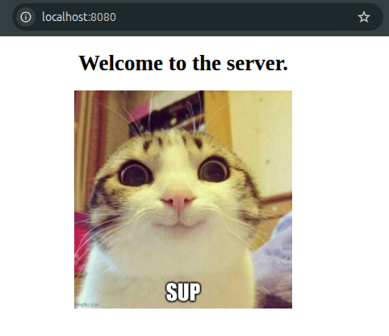
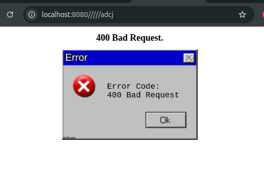
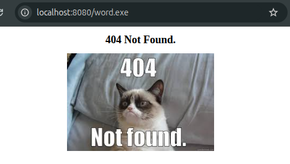

## HTTP server
Very basic HTTP server made in C using low level sockets. Handles GET requests, by serving static files (html, png, jpeg, etc).

Custom error pages for following error codes:
- 400 bad request
- 404 not found
- 405 method not allowed
- 501 not implemented
- 505 http version not supported

### 200 OK Response

The welcome page at "/":

### 400 Bad Request

For an invalid path like "////adcj":

### 404 Not Found

GET request for something thats not in the "server_root/" like "word.exe" in this example:

